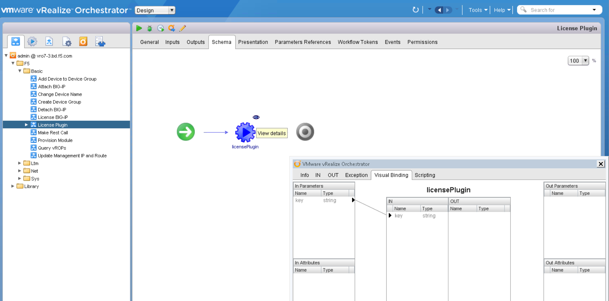
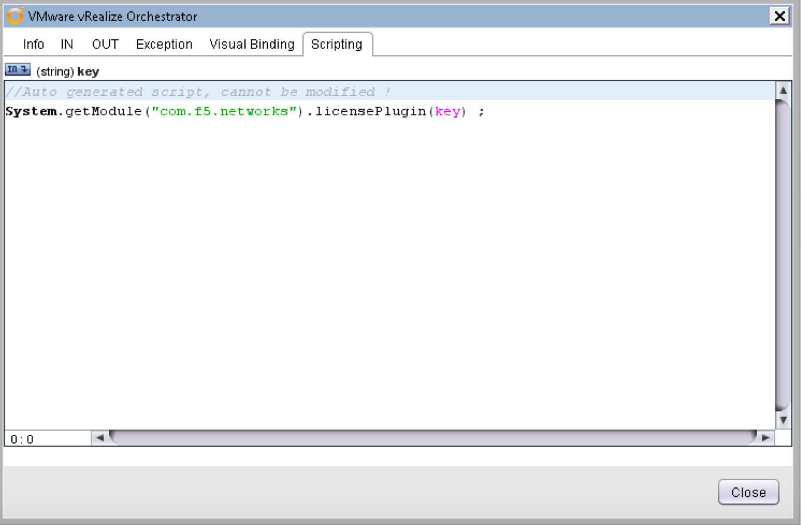
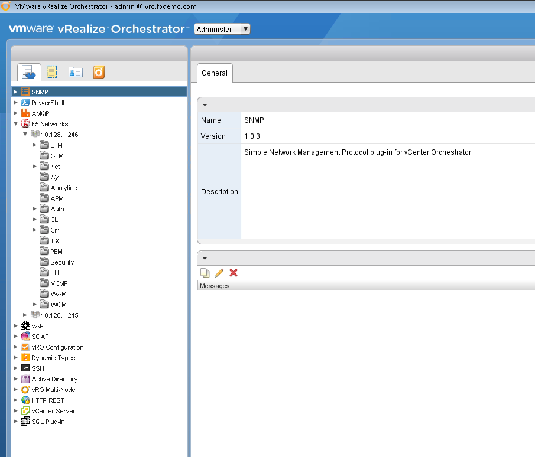

Tour the vRO Interface 
======================

Before we get started in earnest it would be good to take a quick tour of the vRO client 
interface. Here are a few of the important screens you will encounter while working with this 
plug-in. 
 
In the screen capture below you are seeing the Schema of the License Plugin workflow, 
which is a quite simple workflow. Specifically, the View Details of the Action “License 
Plugin”. You can explore the bindings of input and outputs to the actual APIs. 

*	Select the design from the pulldown 

*	Select the Schma Tab

*	Expand  Admin@vro.f5demo.com>>F5>>Basic

*	Select License Plug in from the left panel

*	Right click the mouse over the licensePlugin and select the small icon above and to the right

*	Review the, Out and Scripting tabs on the new window  In parameters mapped to the variables for this particular action. 

   
* Use the pulldown to access the Administrator View   

   
