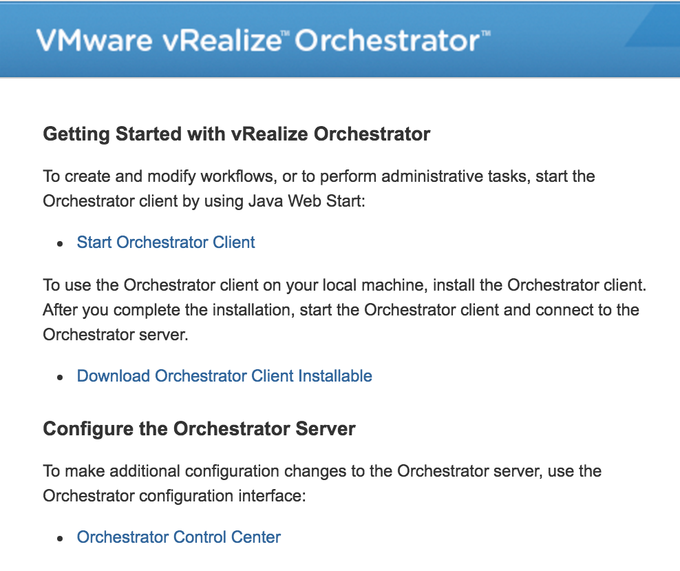
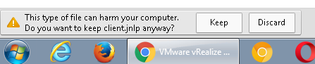
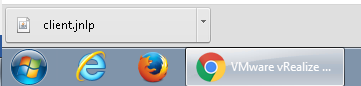
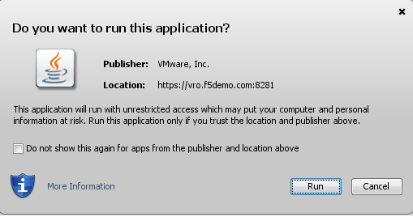

Access the vRO environment and verify that the Blue Medora Plug in is licensed
==============================================================================

* Use the RDP function on your laptop to connect to the “WIN7“ RDP server/workstation 
* Instructor to provide IP address
* Username: Student
* Password: F5Agility-vro
 
 .. image:: ../images/image002.png
   :scale: 50 %
   :align: center

* Connect to the vRO instance/client and check the license
http://vro.f5demo.com which will redirect you to https://vro,f5demo.com:8281/vco 

* Click the Start Orchestrator Client link. 

 

* This will open a warning in the toolbar, Click Keep

               . 
* Launch The Java Client bt clicking it

              
* If you are asked to proceed to an untrusted website, Click Continue.

   
* Do you want to run this application. Click Run

*	You will be presented with the actual vRO login screen. Verify or 
  choose from the dropdown vro.f5demo.com:8281 
-	User Name vcoadmin 
-	Password vcoadmin
-	click Login. 
   
 .. image:: ../images/image007.png
   :scale: 50 %
   :align: center  
      

*	If you receive a Certificate Warning If you do make sure to put the checkmark in 
  the Install this certificate… checkbox and click Ignore

  

